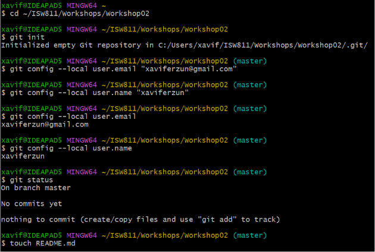
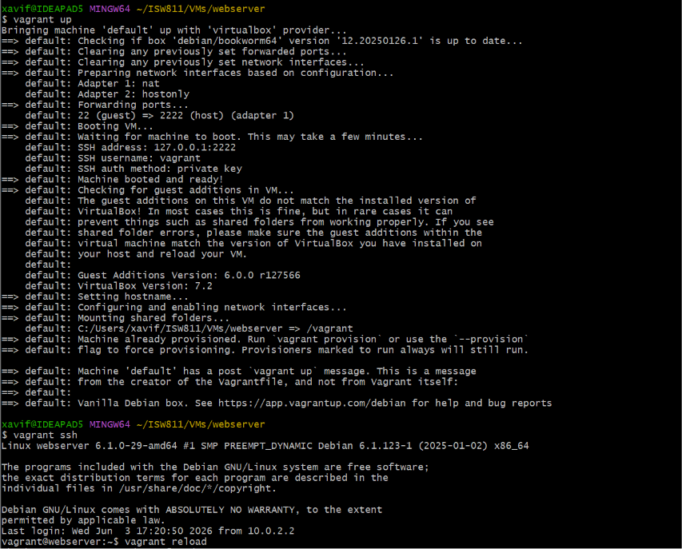
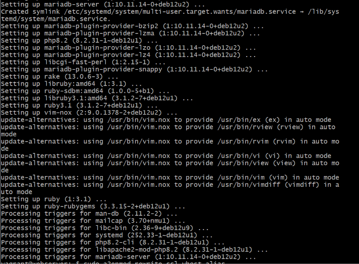
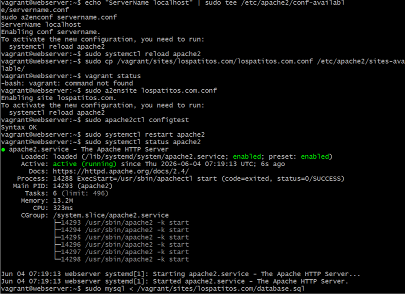
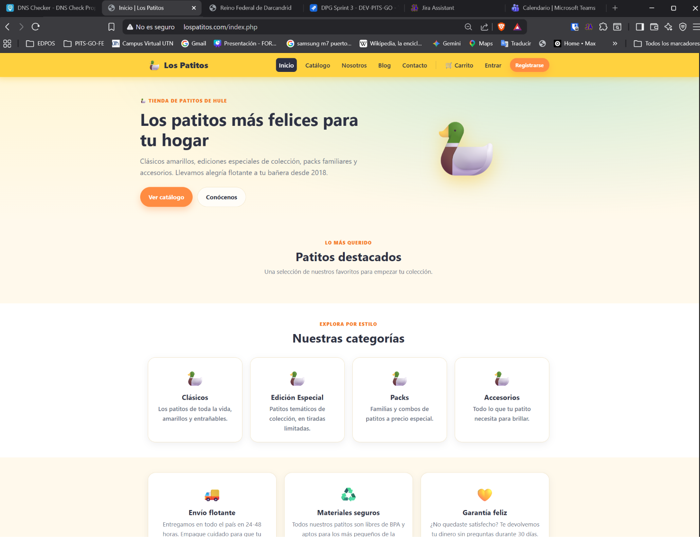
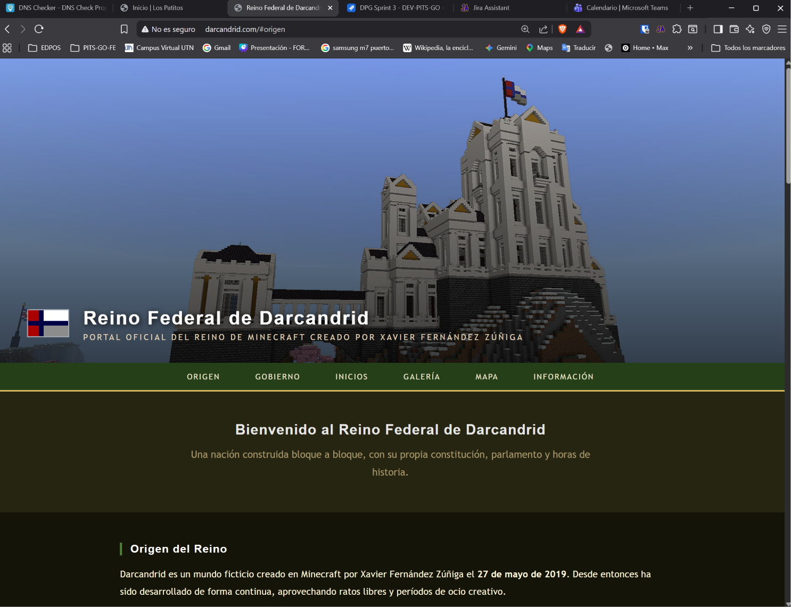
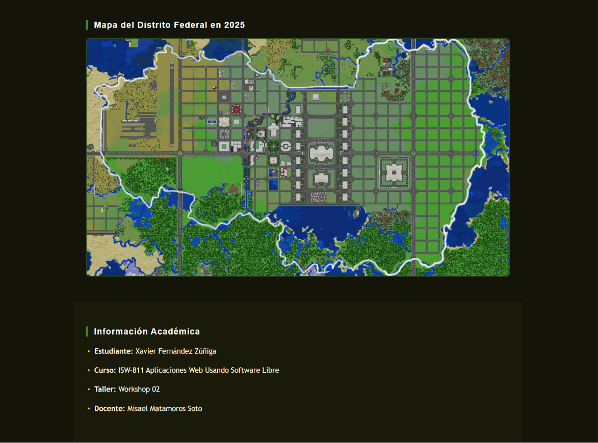

<table border="0">
  <tr>
    <td>
      <strong>Universidad Técnica Nacional</strong><br>
      ISW-811 Aplicaciones Web – Software Libre<br>
      <strong>Docente:</strong> Misael Matamoros Soto<br>
      <strong>Estudiante:</strong> Xavier Fernández Zúñiga<br>
      <strong>Fecha de entrega:</strong> 10 de Junio 2026
    </td>
    <td align="right">
      
    </td>
  </tr>
</table>

# Workshop 02 – Servidor LAMP con Vagrant

---

## 1. Configuración inicial de Git

Antes de empezar configuré Git con mi identidad para que los commits quedaran correctamente firmados. En este caso usé configuración local dentro del repositorio del workshop para no afectar la configuración global que uso con otra cuenta para mi trabajito freelance.

```bash
git config --local user.name "xaviferzun"
git config --local user.email "xaviferzun@gmail.com"
```



---

## 2. Preparación del entorno Vagrant

La máquina virtual del curso ya estaba ubicada en `~/ISW811/VMs/webserver`. Dentro de esa carpeta creé el directorio `sites/` que luego se compartiria con la VM.

```bash
cd ~/ISW811/VMs/webserver
mkdir -p sites
```

### Modificación del Vagrantfile

Agregué dos líneas al Vagrantfile para compartir la carpeta `sites/` con la máquina virtual de dos formas distintas:

```ruby
config.vm.synced_folder "sites/", "/vagrant/sites", owner: "www-data", group: "www-data"
config.vm.synced_folder "sites/", "/home/vagrant/sites"
```

---

## 3. Clonar sitio de ejemplo

Desde la VM, navegué a `/vagrant/sites` y cloné el repositorio del sitio de ejemplo:

```bash
cd /vagrant/sites
git clone https://github.com/mismatso/lospatitos.git lospatitos.com
```

Antes de poder clonar olvidé un paso importante, instalar Git en la VM ya que la imagen base de Debian no lo incluye:

```bash
sudo apt install -y git
```

Al finalizar, la carpeta del profe `lospatitos.com` quedó disponible dentro de `sites/`.


## 4. Configuración del archivo hosts

Para acceder al sitio por nombre de dominio desde el navegador del host, edité el archivo `hosts` de Windows con privilegios de administrador y agregué las siguientes entradas:
192.168.56.10 lospatitos.com
192.168.56.10 darcandrid.com (la mía)

---

## 5. Inicio y acceso a la máquina virtual

```bash
vagrant up
vagrant ssh
```



---

## 6. Instalación del servidor LAMP

Dentro de la VM, actualicé el índice de paquetes e instalé todos los componentes del stack LAMP:



---

## 7. Configuración de Apache

### Módulos habilitados

```bash
sudo a2enmod rewrite ssl vhost_alias
```

El módulo `rewrite` permite reescribir URLs, `ssl` habilita soporte HTTPS, y `vhost_alias` facilita el manejo de múltiples virtual hosts.

### ServerName

Para evitar advertencias al iniciar Apache, configuré el ServerName:

```bash
echo "ServerName localhost" | sudo tee /etc/apache2/conf-available/servername.conf
sudo a2enconf servername.conf
sudo systemctl reload apache2
```

### Virtual host de lospatitos.com

```bash
sudo cp /vagrant/sites/lospatitos.com/lospatitos.com.conf /etc/apache2/sites-available/
sudo a2ensite lospatitos.com.conf
```

---

## 8. Verificación de funcionamiento

```bash
sudo apache2ctl configtest
sudo systemctl restart apache2
sudo systemctl status apache2
```



### Sitio lospatitos.com en el navegador



---

## 9. Restauración de la base de datos

El repositorio de lospatitos incluye un script SQL. Al importarlo hubo un problema de compatibilidad con emojis en MariaDB — el valor por defecto `'🦆'` en campos VARCHAR causaba un error `Invalid default value`. Para resolverlo, primero cambié el `sql_mode` global y luego reimporté:

```bash
sudo mysql -e "DROP DATABASE IF EXISTS lospatitos;"
sudo mysql -e "SET GLOBAL sql_mode = 'NO_ENGINE_SUBSTITUTION'; SOURCE /vagrant/sites/lospatitos.com/database.sql;" 2>/dev/null
```

Las tablas que aún fallaban por dependencias de foreign keys entoncs las creé manualmente sin el campo emoji.

---

## 10. Despliegue del segundo sitio web

Para el segundo teníamos una propuesta de un sitio Aguacate, sin embargo decidí crear algo diferente y más original para mí, una página sobre **Darcandrid**, mi mundo ficticio en Minecraft que creé en 2019 y he desarrollado desde entonces. Nunca había hecho una página sobre él jeje, y tenía sentido hacerlo aquí porque conozco el tema a fondo y el resultado sería interesante.

### Nombre de dominio utilizado
darcandrid.com

### Ruta del sitio
~/ISW811/VMs/webserver/sites/darcandrid.com

### Estructura de archivos
darcandrid.com/
├── index.php
├── darcandrid.com.conf
├── css/
│   └── style.css
└── images/
├── CastilloPortada.jpg
├── Capitolio1.jpg
├── Capitolio2.jpg
└── ...

### Archivo de configuración Apache

```apache
<VirtualHost *:80>
    ServerName darcandrid.com
    ServerAlias www.darcandrid.com
    DocumentRoot /vagrant/sites/darcandrid.com

    <Directory /vagrant/sites/darcandrid.com>
        Options Indexes FollowSymLinks
        AllowOverride All
        Require all granted
    </Directory>

    ErrorLog ${APACHE_LOG_DIR}/darcandrid.com.error.log
    CustomLog ${APACHE_LOG_DIR}/darcandrid.com.access.log combined
</VirtualHost>
```

### Habilitación del sitio

```bash
sudo cp /vagrant/sites/darcandrid.com/darcandrid.com.conf /etc/apache2/sites-available/
sudo a2ensite darcandrid.com.conf
sudo apache2ctl configtest
sudo systemctl restart apache2
```

### Entrada en el archivo hosts
192.168.56.10 darcandrid.com

### Prueba funcional de PHP

El sitio muestra la fecha y hora actual del servidor generada dinámicamente con PHP:

```php
$fecha = date('d \d\e F \d\e Y');
$hora = date('H:i');
```

### Resultado en el navegador




